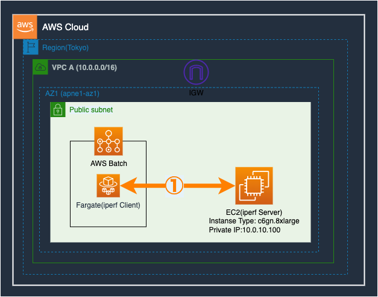

# AWS Fargateネットワーク帯域の測定環境を作成するためのコード(同一AZ内)

## 概要
Terraformを使ってFargateの帯域測定をするリソースを作成できます。  
今回のコードを利用して実際に測定した結果は[zenn](https://zenn.dev/tsumita7/articles/measured-fargate-network-bandwidth)にて公開しています。  
**※以下の内容を実行することによって生じた一切の障害について当方はその責任を負いません**

## 構成図


## 前提
- [Terraform](https://learn.hashicorp.com/tutorials/terraform/install-cli)がインストール済みであること
- 適切な権限を付与したAWS Credentialを作成済みであること
    - 今回はテストのために"AdministratorAccess"を付与したAWS Credentialを作成しました
- AWS認証を行うための認証情報が設定済みであること([Terraform公式 ドキュメント
](https://registry.terraform.io/providers/hashicorp/aws/latest/docs))

## 使用方法

**注意点:**  
測定後すぐに`terraform destroy`で環境を削除すれば$10未満の費用で測定できると思います。  
環境を残しておくと高額なAWS利用料が請求される可能性があるので、測定後は速やかに`terraform destory`で環境削除することを推奨します。  

1. 環境作成  
terraformディレクトリに移動後、以下コマンドを実行後に確認メッセージが出力されたら'yes'をタイプしてEnterを押下すると、数分程度でリソースが作成されます。
```sh
terraform init && terraform apply
```

2. 測定  
ルートディレクトリで以下コマンドを実施するとAWS Batchジョブが投入されます。  
`<JOB_QUEUE_ARN>`と`<JOB_DEFINITION_ARN>`は`1.`で出力された値に置き換えてください。  
```sh
bash aws-batch-job-exec.sh test-list.txt <JOB_QUEUE_ARN> <JOB_DEFINITION_ARN>
```

3. 測定結果確認
CloudWatch Logsの`/aws/batch/job`ロググループに測定結果が出力されます。  
該当ロググループを開いた後`Search all log streams`を押下し、検索ボックスに`" sender"`と入れて検索すると、resultだけ一覧で見れます。  

4. 環境削除
terraformディレクトリに移動後、以下コマンドを実行後に確認メッセージが出力されたら'yes'をタイプしてEnterを押下すると、数分程度でリソースが削除されます。
```sh
terraform destroy
```

# 作成者
Yuki Tsumita ([Twitter](https://twitter.com/tsumita7))

# License
このリポジトリはMITライセンスです。詳しくは`LICENSE`を参照してください。